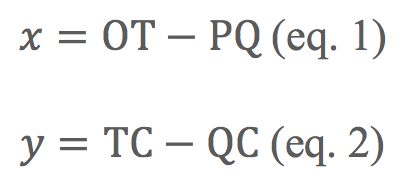
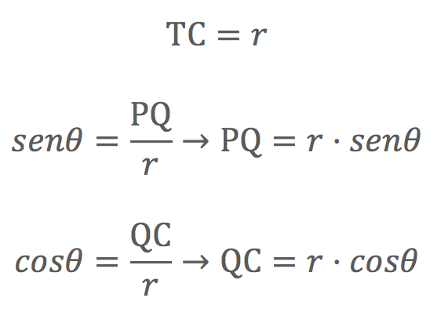
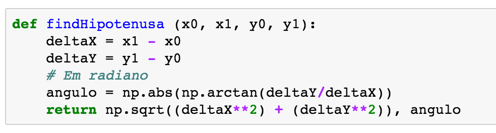
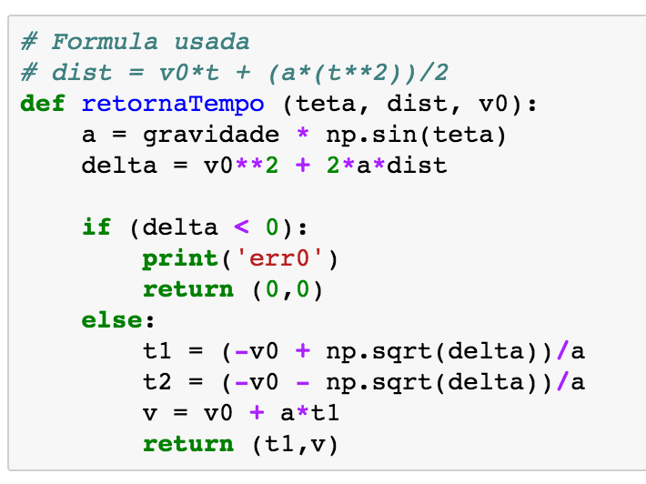
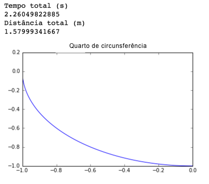
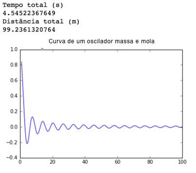
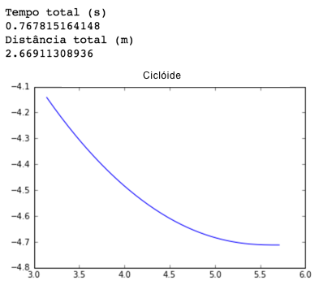
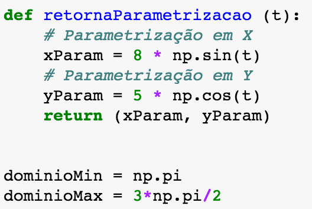

### Simulação Computacional de Curvas
#### Daniel Ruhman e Marcelo Terreiro Prado

O projeto a seguir foi realizado para a disciplina de Matemática Multivariada ministrada pelo Professor Fabio Orfali no curso de Engenharia do INSPER.
Ele tem como objetivo o desenvolvimento de uma simulação computacional baseada em métodos numéricos (mais especificamente a aproximação de uma curva por uma linha poligonal composta por _n_ segmentos) para calcular o tempo aproximado que um objeto, sujeito apenas à força da gravidade, leva para percorrer uma trajetória dada por curvas parametrizadas e pontos iniciais e finais ou domínio.

#### Dedução	geométrica	da	parametrização	da	cicloide

Considere uma circunferência C de raio _r_ com um ponto P, fixo. Ao rolar a circunferência sobre uma reta (eixo x), o ponto P percorre uma curva chamada de ciclóide. Queremos descobrir quanto a curva "caminhou" em cada eixo. A seguir, apresentamos a dedução geométrica para sua parametrização, partindo dos seguintes pressupostos:

* _θ_ = 0 no início, gira _θ_ radianos;
* o ponto P coincide com a origem do sistema de coordenadas no início do movimento;

 Fig 1

Podemos então escrever:

Com os deslocamentos de x e y em mãos, precisamos descobrir os segmentos de reta para determinar as parametrizações em relação ao parâmetro _θ_. Comecemos por |OT| . Como C está em contato com a reta, deduzimos que:

Podemos deduzir pela figura as medidas dos outros 3 segmentos restantes:

Agora resta substituir as medidas dos segmentos encontrados nas equações 1 e 2 e obtemos a parametrização final:

---

### Modelo Computacional

O modelo desenvolvido pelo grupo encontra-se explicado abaixo. Inicialmente, declaramos as variáveis que irão armazenar as parametrizações, além de definir alguns parâmetros e algumas burocracias de código. Também definimos o domínio (ex: de 0 a 2π) das parametrizações.
##### Coloque a sua parametrização e o domínio nas variáveis abaixo

Depois, declaramos uma função cujo objetivo é achar os comprimentos dos segmentos de reta que usaremos para aproximar a curva. Esses segmentos são, como mostra a imagem, a hipotenusa entre dois pontos da curva. A diferença entre esses pontos é a precisão do cálculo. Quanto menor a diferença entre eles, melhor a aproximação. A função recebe os pontos para os quais calcular o segmento de reta, obtidos através da função acima. Além disso, ela retorna o ângulo de inclinação das retas que irá nos ajudar a calcular o tempo.

 Fig 2

Então, declaramos uma função que irá nos retornar o tempo de percurso de cada segmento de reta. Ela recebe como parâmetros o ângulo de inclinação, a distância (hipotenusa) e a velocidade inicial. E ela retorna o tempo de percurso e a velocidade final (que será utilizada como inicial para a próxima iteração, e assim por diante).
Para calcular o tempo, utilizamos a equação:

Como já possuimos os parâmetros _ΔS_ (comprimento do segmento/hipotenusa), _v0_ (inicialmente 0, depois igual à velocidade final no segmento anterior) e _a_ (aceleração da gravidade), só precisamos isolar o _t_.

Por fim, contruímos o loop que junta todas essa funções. Ele roda para cada intervalo de precisão definido, e tem o seguinte comportamento:
* Primeiro, descobre as coordenadas dos dois pontos do segmento aproximado por um segmento de reta, com base na precisão pré definida
* Depois, descobre o comprimento desse segmento de reta (hipotenusa) e o seu ângulo de inclinação, usando seu ponto inicial e final.
* Então, calcula o tempo necessário para percorrer tal segmento e o adiciona ao tempo total para percorrer a curva.
* Isso é repetido para cada intervalo de precisão definido, até percorrer a curva inteira.

Por fim, imprime os valores (nesse caso, **um quarto de circunferência**):

---
### Validação

Abaixo está a validação da nossa simulação computacional. Nela, utilizamos uma reta parametrizada. Olhando seu domínio, fica claro que a distância percorrida faz sentido. Utilizando pitágoras, pode-se perceber que a distância vale raiz quadradada de 200, o que bate com nosso resultado.

 

 

 

Vale ressaltar que nossa implementação também considera o caso da bolinha não ter energia suficiente para subir a curva (Figura 2).

Para o cálculo do tempo, utilizamos uma reta vertical definida com x constante. Em seguida, calculamos o tempo que levaria para a bolinha percorrer o trajeto inteiro e validamos utilizando a física. Esse tempo precisa ser igual ao tempo necessário para ela cair em queda-livre.

Tivemos bastante dificuldade para validar o tempo que a bolinha leva para percorrer determinada curva. Abaixo estão descritas as tentativas realizadas.

1. Calcular o tempo que a bolinha leva para percorrer uma reta. Tivemos problemas para calcular o tempo teórico que levaria (tanto pela literatura matemática quanto pela física), e por isso acabamos trocando de tentativa.

2. Calcular o tempo que a bolinha leva para percorrer uma reta vertical, com x constante. Da mesma forma que na tentativa acima, tivemos problemas. Dessa vez foi com o código. Ele reclamava de nossa equação utilizada na função `retornaTempo`, provavelmente devido a maneira com que dividimos a curva e distribuímos as forças. Sabendo esse tempo, utilizaríamos a fórmula da cinemática de posição em função do tempo para checarmos por valores iguais. Acreditamos ser por conta da utilização de `cosseno` e não `seno` na função `retornaTempo`. Entretanto, não conseguimos fazer a função funcionar com o `seno`.
3. Descobrir o tempo real de uma ciclóide e comparar com o tempo calculado pela simulação. Conversamos nosso colega (Eduardo Ferrari) e testamos com a ciclóide construída por ele. Tivemos muita dificuldade para medir o tempo, que da menos de 1 segundo na rampa construída. Além disso, tivemos dificuldade em descobrir os parâmetros exatos da ciclóide construída para equacionar uma semelhante.

Tivemos bastante dificuldade para validar o tempo que a bolinha leva para percorrer determinada curva.

Porém, para a reentrega conseguimos resolver os problemas. Utilizamos o seno na decomposição de forças e, percebemos que para calcular o angulo da inclinação de cada segmento, seria necessário utilizar o módulo de DeltaY/DeltaX. Feito isso o modelo foi corrigido e agora se encontra de acordo com a realidade.

---
### Plots de Curvas Parametrizadas

Abaixo estão exemplos de plots que fizemos para algumas curvas parametrizadas. As imagens à esquerda são as funções utilizadas e o domínio. As imagens à direita são o resultado do plot.

 

#### 1. Curva de um oscilador massa-mola

#### 2. Curva de uma ciclóide

 

#### 3. Curva de uma elipse

 

---
### Conclusões

Um dos objetivos do projeto era identificar se a bolinha caía mais rápido em uma ciclóide do que em outra curva qualquer. Comparando as figuras 1 e 5, percebemos que de fato a ciclóide apresenta um menor tempo de queda, com 0.767 segundos em comparação aos 2.260 segundos da circunferência. Entretanto, precisamos analisar os eixos. Tivemos problemas na hora de plotá-las com ponto final e inicial definidos, já que nosso código foi estruturado com base em domínios. Dessa forma, não podemos comparar seus tempos com exatidão.

O modelo computacional criado é válido. Entretanto, tivemos algumas dificuldades em validá-lo usando a física e a matemática. Por conta disso não conseguimos corrigir alguns problemas, principalmente os relacionados com a física do projeto. Acreditamos ter criado um método correto, porém não podemos ter certeza pela falta de uma validação coerente. Em uma segunda iteração desse projeto, iremos verificar a equação utilizada na função `retornaTempo` e nos aprofundar em alguma validação.
